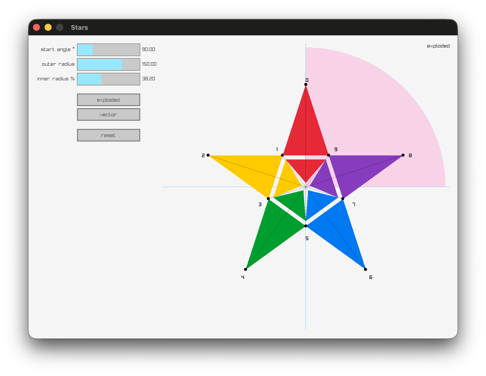

# Stars

When I wrote Minesweeper, I wanted to draw stars but didn't see a direct way in raylib to do it. (Please let me know if I missed it.) This is a quick app to explore the way I draw stars in raylib. It has the most value when it's run while reading/modifying the code.



# Build

No binaries. You will need to build Stars from source if you want to try it.

1. [Install Odin](https://odin-lang.org/docs/install/) if you haven't done so already

2. Clone this repository
```console
git clone https://github.com/chris-braun/stars.git
```

3. Run it with Odin
```console
cd stars
odin run .
```
